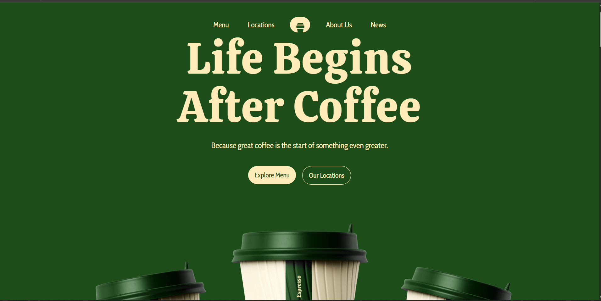

# Brewhaus Coffee Shop ☕

A simple and clean coffee shop website showcasing multiple locations across New York City. Built as a practice project to improve web development skills.

## 📸 Screenshot



## 🌟 Features

- Multiple location information display
- Responsive design for all devices
- Clean and modern UI
- Multiple pages (Home, Locations, Menu, About, News)
- Image gallery with modern AVIF format
- Interactive navigation menu
- Optimized images for fast loading

## 🛠️ Technologies Used

- HTML5
- CSS3
- JavaScript
- AVIF image format

## 📦 Installation

1. Clone the repository:
```bash
https://github.com/ibrahimmdef/the-coffee-shop.git
cd the-coffee-shop
```

2. Open in browser:
   - Simply open `public/index.html` in your web browser
   - Or use a local server:
```bash
python -m http.server 8000
```

## 📁 Project Structure

```
coffeeshop/
├── public/
│   ├── assets/              # Images and media files
│   ├── styles/              # CSS files
│   │   ├── styles.css       # Main styles
│   │   ├── menu.css         # Menu page styles
│   │   ├── location.css     # Location page styles
│   │   └── comming-soon.css
│   ├── index.js             # Main JavaScript
│   ├── index.html           # Homepage
│   ├── about.html           # About page
│   ├── locations.html       # Locations page
│   ├── menu.html            # Menu page
│   └── news.html            # News page
└── README.md
```

## 🗺️ Locations

**Brooklyn**  
123 Bedford Ave, Brooklyn, NY 11211  
Open daily: 7AM – 7PM

**Queens - Astoria**  
789 Broadway, Queens, NY 11106  
Open daily: 7AM – 8PM

**Manhattan**  
456 Spring St, New York, NY 10012  
Open daily: 7AM – 6PM

**Queens - Flushing**  
134-16 36th Road, Flushing, NY 11354  
Open daily: 8AM – 6PM

## 🎯 Purpose

This is a practice project created to learn and improve:
- HTML5 semantic markup
- CSS3 styling and animations
- Responsive web design principles
- JavaScript DOM manipulation
- Modern image formats (AVIF)
- Multi-page website structure
- File organization and project structure

## 💡 What I Learned

- Building responsive layouts with CSS Grid and Flexbox
- Implementing navigation across multiple pages
- Working with modern image formats for better performance
- Organizing CSS files for better maintainability
- Creating a consistent design system
- Structuring a multi-page website project

## 📝 Note

This project is for educational purposes and portfolio demonstration. Feel free to explore the code and use it as a reference for your own projects!

## 🚀 Live Demo

[View Live Demo](https://the-coffee-shop-x24r.onrender.com/)

## 📄 License

MIT License
